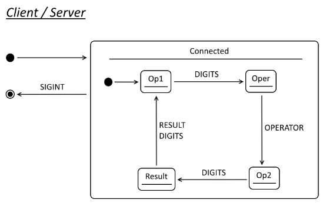

# Arithmetic Server Example

The arithmetic client sends a basic arithmetical expression to a remote server 
which returns the result.

## Goals

1. More client-server state transitions than in earlier examples.
1. Simple state synchronisation between client and server.

## Implementation

### Overall Behaviour

Support for a single binary arithmetic operator.

The parts of each expression are sent to the server in stepwise fashion, as follows:

| User Action                       | Client Action          | Server Action         |
| :-------------------------------- | :--------------------- | :-------------------- |
| Enters integer constant e.g. `1`  | Sends `1`              | Receives operand      |
| Enters operator e.g. `+`          | Sends `+`              | Receives operator     |
| Enters integer constant e.g. `2`  | Sends `2`              | Receives operand      |
| Waits for result...               | Receives/prints result | Sends result i.e. `3` |
| Enters integer and so on.         | Sends ...              | Receives ...          |

### States



### Formal Grammar

The following ABNF grammar defines the protocol:

```abnf
;       Traffic consists of operands, operators, and results
traffic             = *(operand / operator / result)

;       Integer constant value
operand             = number-2

;       Arithmetic operators (*+-/)
operator            = %d42 / %d43 / %d45 / %d47

;       Integer result value
result              = number-4

;       Numbers stored in network byte order
number-2            = 2OCTET
number-4            = 4OCTET
```

## Security

All messages are sent between nodes in plain text.

### Notes

n.b. type safety is moot (if not misplaced) at the point where data is passed into the
Server because validation (and serialisation) would be performed within the Service by
the current State, or more accurately by the fsm.Input on the associated event (fsm.Event).
so code such as the following which copies values to the Service using the relevant
input types resembles what would happen within a simple call to Service.Send()/.Execute()
(or whatever the API ends up looking like):

```go
msgs.Num.Copy(a, svc)
msgs.Op.Copy(op, svc)
msgs.Num.Copy(b, svc)
```


