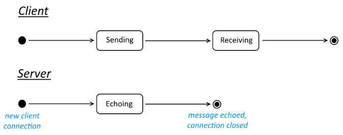

# Example 1: Echo Server

Simple example where one or more client applications send a simple message which is echoed back by a remote server.

It is the simplest of the examples, covering basic usage of the API in a client-server style architecture. No special features or contingencies.

## Goals

Initial exploration of a state-centric API. Simplest possible case.

## Client-Server

A client application takes an arbitrary string as an argument which it sends as plain text to a server.
The server echoes the message back to the client. The client displays the response, plus some basic stats then terminates.

## Implementation

This example doesn't use different message types, protocol signatures, message frames, or commands.

### States

## Security

All messages are sent between nodes in plain text.

