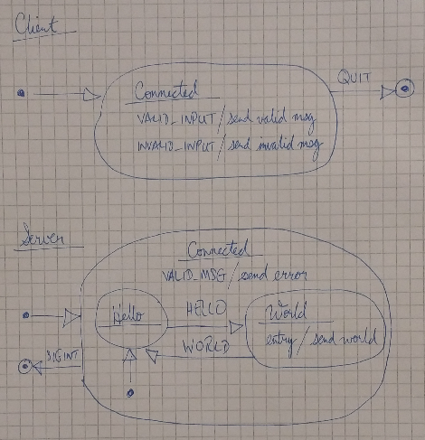

# Example 2: Hello World Server

Simple Hello World client-server example, where a client sends "hello" and receives a response "world". 

Other messages from the client result in different behaviour.

## Goals

Explores the use of a hierarchical state machine *(HSM)* as a mechansim for defining server responses to different messages from a client.

The goals are to:

+ Define a simple protocol.
+ Explore possible implementations of an HSM.
+ Demonstrate different strategies for responding to invalid client requests.

## Implementation

### Overall Behaviour

The hello world client provides an interface for sending valid and invalid request
messages<sup>1</sup> to a remote hello world server.

If a client sends a valid message with a body of "hello" then the server will 
respond with "world".

If a client sends a valid message containing any text besides "hello"<sup>2</sup> 
then the server will return an error response.

If a client sends an invalid message then the server will ignore the message,
leaving the connection open to the client. Although it might seem sensible to close 
the connection, this approach was chosen in order to demonstrate default behaviour
of a state machine, that is, to ignore input.

*1. See formal grammar below for definition of valid request message.*

*2. Message comparison is case-sensitive.*

### States



### Formal Grammar

The following ABNF grammar defines the protocol:

```abnf
;       Client sends valid request
hello               = signature %d1 hello-body
hello-body          = number-1 %s"hello"

;       Server sends OK response to client
world               = signature %d2 world-body
world-body          = number-1 %s"world"

;       Server tells client it sent an invalid message
rtfm                = signature %d3 reason
reason              = string

;       Included for illustration purposes
valid-request       = signature number-1 [string]

;       Protocol signature: "HW" (two octets)
signature           = %x48 %x57

;       Short printable string with length prefix (max. 255 chars)
string              = number-1 *VCHAR

;       Number stored in single octet
number-1            = 1OCTET
```

## Security

All messages are sent between nodes in plain text.


