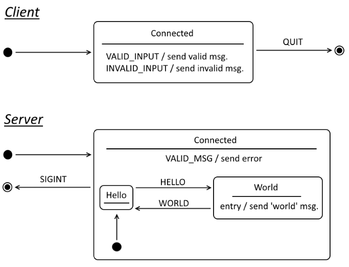

# Example 2: Hello World Server

Simple Hello World client-server example, where a client receives a "world" response from a remote server if and only if a "hello" request is sent.

## Goals

Explores the use of a hierarchical state machine *(HSM)* as a mechansim for defining server responses to different messages from a client.

The goals are to:

+ Define a simple server protocol.
+ Explore possible implementations of an HSM.
+ Demonstrate different strategies for responding to invalid client requests.

## Implementation

### Overall Behaviour

The hello world client allows the user to enter string messages to be sent to a 
hello word server. Only "hello" is a valid request message. "hi" will result in
an error response from the server. Any other request will be ignored by the server.
Entering "quit" will shut down the client service and terminate the application.

### States



### Formal Grammar

The following ABNF grammar defines the protocol:

```abnf
; TODO: add grammar here.
```

## Security

All messages are sent between nodes in plain text.


