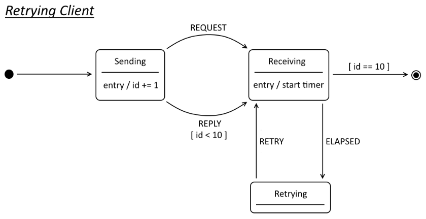
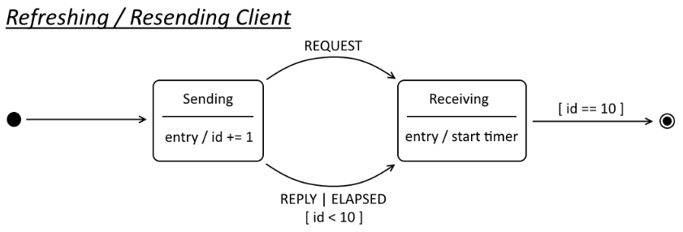
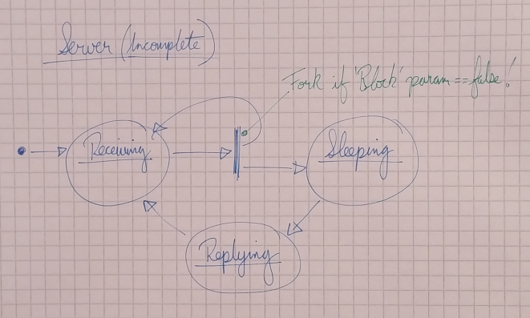

# Timeouts Example

A client app sends a numeric value to a server, the server then sleeps for the
specified amount of time before replying. The client may timeout while waiting
for the server to respond. The client then performs some action based on the 
timeout *(the precise action is configurable)*.

## Goals

1. Explore timeouts using time-based event triggers.
1. Explore some basic strategies for handling timeouts.

## Implementation

### Overall Behaviour

Communication between the client and server follows a synchronous request-reply 
pattern, until a timeout occurs at which point the client may send zero or more
messages without receiving a response from the server.

A client is started with the following command line flags:

| Flag    | Type    | Description                                                              |
| :------ | :------ | :----------------------------------------------------------------------- |
| Sleep   | Integer | *Sleep Duration* value of first request.                                 |
| Step    | Integer | Number of milliseconds to increment *Sleep* for each subsequent request. |
| Timeout | Integer | Number of milliseconds to wait for server to reply.                      |
| Mode    | String  | Specifies how the client/server should behave.                           |

A client sends a maximum of 10 new requests to the server before terminating.

Each message sent from the client to the server contains the following parameters:

| Parameter      | Type    | Details                                                     |
| :------------- | :------ | :---------------------------------------------------------- |
| Id             | Integer | Starts at 1, incremented for each successful request/reply. |
| Retry Counter  | Integer | Set to 0 (zero) for new requests and incremented per retry. |
| Block          | Boolean | If set, the server connection will not receive client requests until the *Sleep Duration* has elapsed. |
| Sleep Duration | Integer | Number of milliseconds the server should sleep before sending a reply. Ignored by server if *Retry Counter* &ne; 0 (zero). |

*n.b. Each parameter is confined its own byte(s) in order to keep things simple, 
but it might be desirable to use bit masks on space constrained, or low throughput
systems.*

The client may be configured to start in various different *modes*, where each
mode may influence both client and server behaviour:

| Client Mode    | Client Behaviour                                           | Server Behaviour |
| :------------- | :--------------------------------------------------------- | :--------------- |
| Abort          | On timeout; aborts request and exits.                      | n/a |
| Retry          | On timeout; resends request with incremented *Retry Counter*. | Server responds to first retry, but not to original request. |
| Retry Blocked  | Same as *Retry*.                                           | Server blocks, responding to request after timeout, retries ignored. |
| Resend         | On timeout; resends request with *Retry Counter* set to zero 0. | Server replies to each request attempt. |
| Resend Blocked | Same as *Refresh*.                                         | Server blocks, responding to each request attempt. |
| Backoff        | Same as *Retry*, but timeout *(retry interval)* doubled each time. | Server blocks, responding to request after timeout, retries ignored. |

### Client States

Broadly speaking the client may be configured to run as 3 different state machines:






### Server States



### Formal Grammar

The following ABNF grammar defines the protocol:

```abnf
;       Traffic consists of requests and replies
traffic         = *(request / reply)

;       Client request sent to Server
request         = id retries block sleep

;       Server reply sent to Client
reply           = id retries "RDY"

;       Request id (1-10)
id              = number-1

;       Rolling request retry number (0-255)
retries         = number-1

;       Blocking flag (single octet)
block           = BIT

;       Sleep duration
sleep           = number-2

;       Numbers stored in network byte order
number-1        = 1OCTET
number-2        = 2OCTET
```


